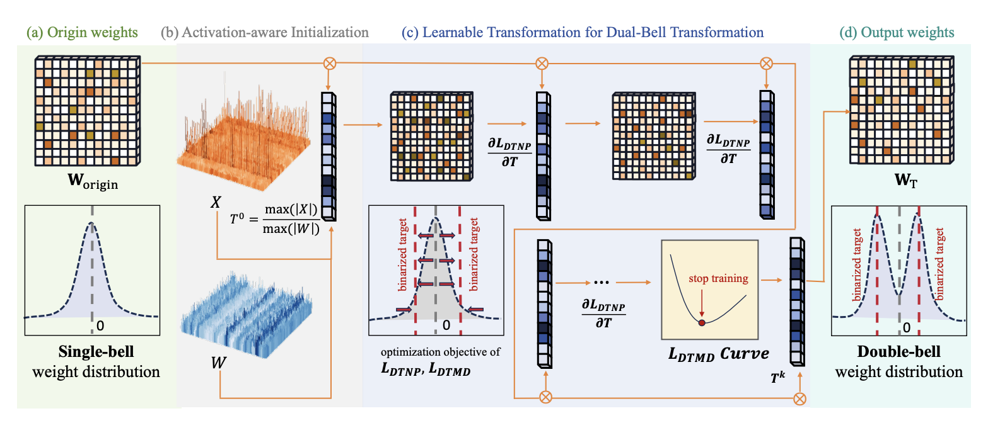
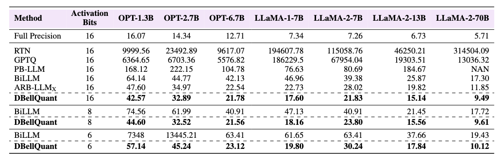

# DBellQuant


## DBellQuant: Breaking the Bell with Double-Bell Transformation for LLM Post Training Binarization

[arXiv](https://arxiv.org/abs/2507.01027)

DBellQuant Framework Overview




Authors: Zijian Ye*, Wei Huang*, Yifei Yu, Tianhe Ren, Zhongrui Wang, Xiaojuan Qi


This repository contains the implementation of the paper:

## Dependencies

```
pip install -r requirements.txt
```

## Runing

DBellQuant for Llama-2 Families

```
python3 run_smooth.py meta-llama/Llama-2-7b-hf c4 braq --blocksize 128 --salient_metric hessian
```

DBellQuant for Llama-1 Families

```
python3 run_smooth.py huggyllama/llama-7b c4 braq --blocksize 128 --salient_metric hessian
```

DBellQuant for OPT Families

```
python3 run_smooth.py facebook/opt-6.7b c4 braq --blocksize 128 --salient_metric hessian
```

DBellQuant for Qwen Families

```
python3 run_smooth.py Qwen/Qwen2.5-7B c4 braq --blocksize 128 --salient_metric hessian
```
Attention: Qwen requires newer transformers version.

## Results

QA results


Perplexity results


